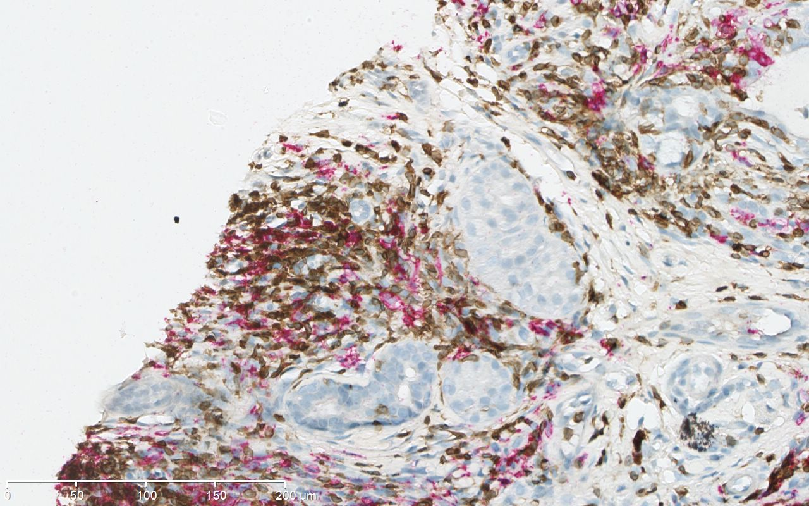
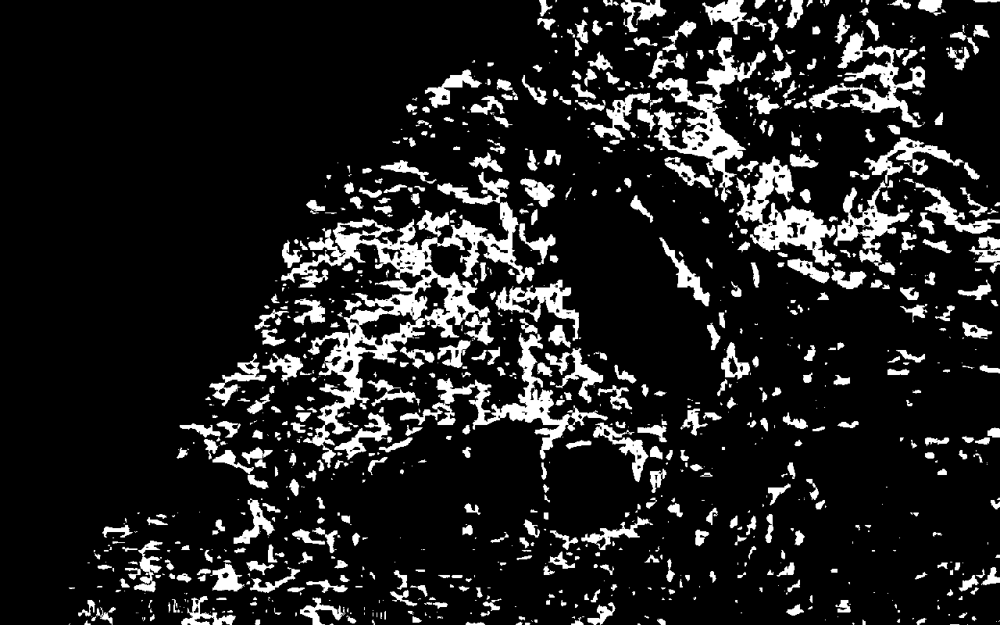
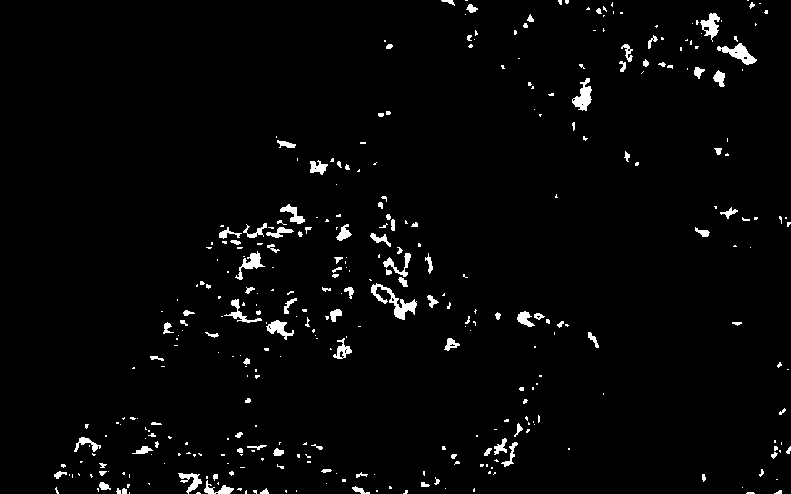

# bgsa 
Python3.X implementation of bgsa-ndpi method.

Adapted code from https://github.com/dridk/bgsa-ndpi.

To run script: 

[Notebook](https://github.com/knave88/bgsa-ndpi/blob/master/bgsa_lr.ipynb) has more details on usage and code to process images and WSI.

### Description
Repository contains implementation of bgsa-ndpi with primitive User Interface and it's Binder-friendly.

Original implementation is an analyser of bgsa using 2 stains for LB / LT recognition

### Examples
Test image

Brown mask

Red mask

